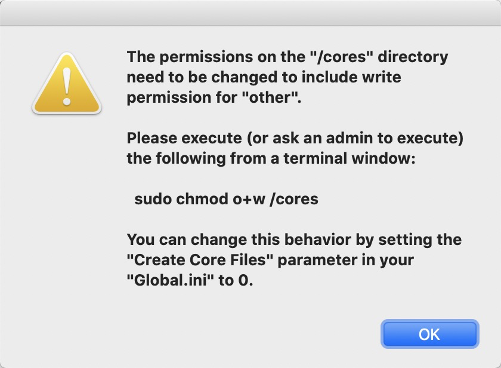
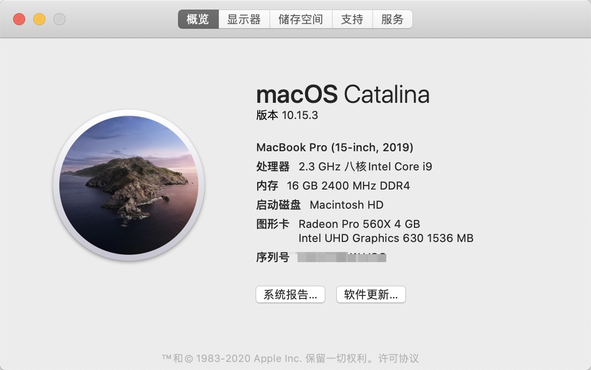

# 前言

刚刚升级完mac系统：macOS Catalina，使用CRT就有报错，但是不影响我们使用，只是每次启动都会报错，很烦人。

报错内容是The permissions on the "/cores" directory need to be changed to include write permission for "other"。

<!--more-->

Please execute (or ask an admin to execute) the following from a terminal window:

sudo chmod o+w /cores

You can change this behavior by setting the "Create Core Files" parameter in your "Global.ini" to 0.



见证一下mac系统



# 解决方法

根据提示执行：

查看下我们本机的 cores 目录权限

```
ls -l /
...
drwxr-xr-x    2 root  wheel    64 12  14 2019 cores
...
```

发现缺少写权限，所以执行

```
sudo chmod o+w /cores
Password:
ls -l /
...
drwxr-xrwx    2 root  wheel    64 12  14 2019 cores
...
```


然后再去启动CRT就正常了。
