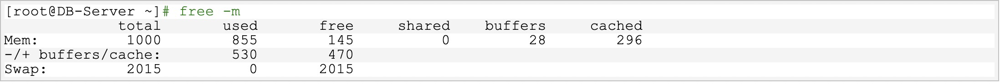
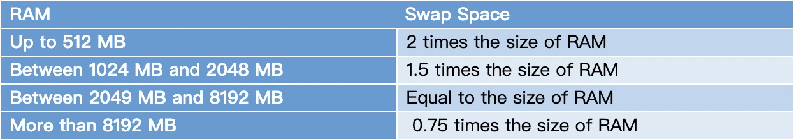
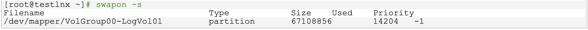
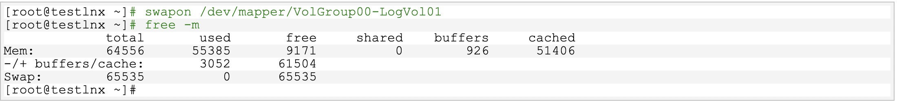

## wap交换分区概念

什么是Linux swap space呢？我们先来看看下面两段关于Linux swap space的英文介绍资料:

Linux divides its physical RAM (random access memory) into chucks of memory called pages. Swapping is the process whereby a page of memory is copied to the preconfigured space on the hard disk, called swap space, to free up that page of memory. The combined sizes of the physical memory and the swap space is the amount of virtual memory available.

Swap space in Linux is used when the amount of physical memory (RAM) is full. If the system needs more memory resources and the RAM is full, inactive pages in memory are moved to the swap space. While swap space can help machines with a small amount of RAM, it should not be considered a replacement for more RAM. Swap space is located on hard drives, which have a slower access time than physical memory.Swap space can be a dedicated swap partition (recommended), a swap file, or a combination of swap partitions and swap files.
<!--more-->
Linux内核为了提高读写效率与速度，会将文件在内存中进行缓存，这部分内存就是 Cache Memory（缓存内存）。即使你的程序运行结束后，Cache Memory 也不会自动释放。这就会导致你在Linux系统中程序频繁读写文件后，你会发现可用物理内存变少。当系统的物理内存不够用的时候，就需要将物理内存中的一部分空间释放出来，以供当前运行的程序使用。那些被释放的空间可能来自一些很长时间没有什么操作的程序，这些被释放的空间被临时保存到swap空间中，等到那些程序要运行时，再从 swap 分区中恢复保存的数据到内存中。这样，系统在物理内存不够时，才进行 swap 交换。

关于 swap 分区，其实我们有很多疑问,如果能弄清楚这些疑问，那么你对 swap 的了解掌握就差不多了。如何查看 swap 分区大小？ swap 分区大小应该如何设置？系统在什么时候会使用 swap 分区? 是否可以调整？ 如何调整 swap 分区的大小？ swap 分区有什么优劣和要注意的地方？ swap 分区是否必要？那么我一个一个来看看这些疑问吧！

## 查看swap分区大小

查看swap分区的大小以及使用情况，一般使用free -m命令即可，如下所示，swap大小为2015M，目前没有使用swap分区

## **wap分区大小设置**

系统的swap分区大小设置多大才是最优呢？ 关于这个问题，应该说只能有一个统一的参考标准，具体还应该根据系统实际情况和内存的负荷综合考虑，像ORACLE的官方文档就推荐如下设置，这个是根据物理内存来做参考的。



另外在其它博客中看到下面一个推荐设置，当然我不清楚其怎么得到这个标准的。是否合理也无从考证。可以作为一个参考。

4G以内的物理内存，SWAP 设置为内存的2倍。

4-8G的物理内存，swap 等于内存大小。

8-64G 的物理内存，swap 设置为8G。

64-256G物理内存，swap 设置为16G。

上下两个标准确实也很让人无所适从。我就有一次在一台ORACLE数据库服务器（64G的RAM），按照官方推荐设置了一个很大的swap分区，但是我发现其实这个swap几乎很少用到，其实是浪费了磁盘空间。所以如果根据系统实际情况和内存的负荷综合考虑，其实应该按照第二个参考标准设置为8G即可。当然这个只是个人的一些认知。

## **释放swap分区空间**

查看swap分区位置



用swapoff关闭交换分区

```swapoff /dev/mapper/VolGroup00-LogVol01```

使用swapon启用交换分区**，此时查看交换分区的使用情况，你会发现used为0了



## Swap分区空间什么时候使用

系统在什么情况或条件下才会使用swap分区的空间呢？ 其实是Linux通过一个参数swappiness来控制的。当然还涉及到复杂的算法。

这个参数值可为 0-100，控制系统 swap 的使用程度。高数值可优先系统性能，在进程不活跃时主动将其转换出物理内存。低数值可优先互动性并尽量避免将进程转换处物理内存，并降低反应延迟。默认值为 60。注意：这个只是一个权值，不是一个百分比值，涉及到系统内核复杂的算法。下面是关于swappiness的相关资料：

The Linux 2.6 kernel added a new kernel parameter called swappiness to let administrators tweak the way Linux swaps. It is a number from 0 to 100. In essence, higher values lead to more pages being swapped, and lower values lead to more applications being kept in memory, even if they are idle. Kernel maintainer Andrew Morton has said that he runs his desktop machines with a swappiness of 100, stating that "My point is that decreasing the tendency of the kernel to swap stuff out is wrong. You really don't want hundreds of megabytes of BloatyApp's untouched memory floating about in the machine. Get it out on the disk, use the memory for something useful."

Swappiness is a property of the Linux kernel that changes the balance between swapping out runtime memory, as opposed to dropping pages from the system page cache. Swappiness can be set to values between 0 and 100 inclusive. A low value means the kernel will try to avoid swapping as much as possible where a higher value instead will make the kernel aggressively try to use swap space. The default value is 60, and for most desktop systems, setting it to 100 may affect the overall performance, whereas setting it lower (even 0) may improve interactivity (by decreasing response latency.


